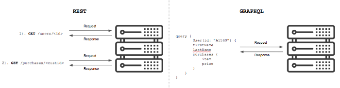
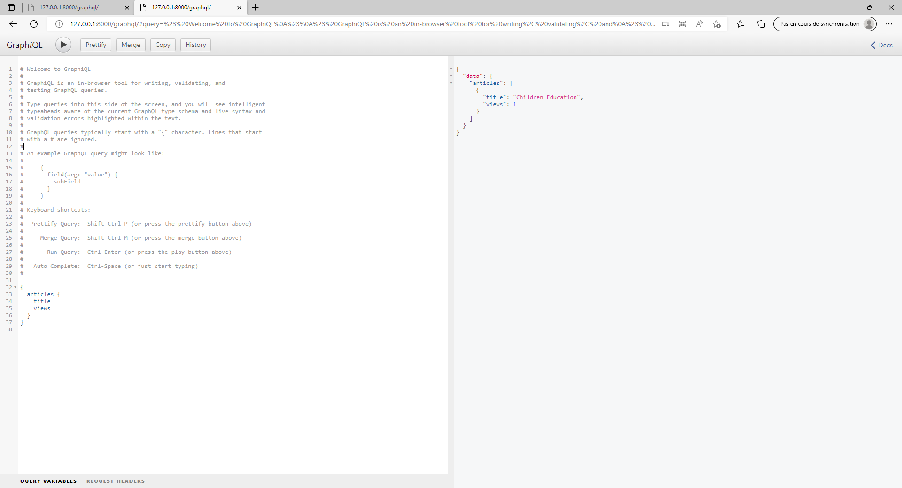

## GRAPHQL (Graphene Framework)


GraphQl est un langage de requête crée par Facebook . Il améliore l'architecture API REST et permet un retour des données sur différents shémas.




Comme vous pouvez le voir, il y a qu'un seul point de terminaison contrairement au API REST 

## Installation 

```
pipenv shell
```

ATTENTION : GraphQL ne fonctionne pas très bien avec la version 4 de Django.
```
pipenv install Django==3.1.7
pipenv install pillow
pipenv install graphene-django==2.14.0
```


```
django-admin startproject core 
cd core
django-admin startapp article 
```


```
py manage.py makemigrations
py manage.py migrate
py manage.py createsuperuser
```


```py
# Application definition

INSTALLED_APPS = [
    'django.contrib.admin',
    'django.contrib.auth',
    'django.contrib.contenttypes',
    'django.contrib.sessions',
    'django.contrib.messages',
    'django.contrib.staticfiles',
    'article', # ajout
    'graphene_django', # ajout
]


...

MEDIA_URL = '/media/' # ajout
MEDIA_ROOT = BASE_DIR / 'media/' # ajout
```

## Models

article/models.py :
```py
from distutils.command.upload import upload
from django.db import models
from django.contrib.auth.models import User

ARTICLE_STATUS_CHOICES = [
    ('published','Publish'),
    ('draft','draft'),
]

class Article(models.Model):
    author = models.ForeignKey(User, on_delete=models.CASCADE, related_name='articles',)
    title = models.CharField(max_length=155,)
    body = models.TextField()
    cover_picture = models.ImageField(blank = True, null = True, upload_to='articles/coverImages/',)
    status = models.CharField(max_length=15, choices=ARTICLE_STATUS_CHOICES, default='draft',)
    views = models.PositiveBigIntegerField(default=0)
    users_clapped = models.ManyToManyField(User, related_name='clapped_articles', blank=True,)
    created_on_timestamp = models.DateTimeField(auto_now_add=True,)
    updated_on_timestamp = models.DateTimeField(auto_now_add=True,)

class CommentOnArticle(models.Model):
    article = models.ForeignKey(Article, on_delete=models.CASCADE, related_name='article_comments',)
    commenter = models.ForeignKey(User, on_delete=models.CASCADE, related_name='article_comments',)
    parent_comment = models.ForeignKey('self', null = True, blank= True, on_delete=models.CASCADE, related_name='replies',)
    body = models.TextField()
    created_on_timestamp = models.DateTimeField(auto_now_add=True)


```

aticle/admin.py :
```py
from django.contrib import admin

# Register your models here.

from article.models import Article, CommentOnArticle


@admin.register(Article)
class ArticleAdmin(admin.ModelAdmin):
    pass

@admin.register(CommentOnArticle)
class CommentOnArticleAdmin(admin.ModelAdmin):
    pass


```

core/urls.py : 
```py
from django.contrib import admin
from django.urls import path
from django.conf import settings # ajout
from django.conf.urls.static import static # ajout
from graphene_django.views import GraphQLView # ajout
from django.views.decorators.csrf import csrf_exempt # ajout

urlpatterns = [
    path('admin/', admin.site.urls),
    path('graphql/', csrf_exempt(GraphQLView.as_view(graphiql=True))), # ajout
]+ static(settings.MEDIA_URL, document_root=settings.MEDIA_ROOT) # ajout
```

article/schema.py :
```py
import graphene 
from graphene_django import DjangoObjectType

from article.models import(
    Article, CommentOnArticle,
)

class ArticleType(DjangoObjectType):
    class Meta:
        model = Article

class CommentOnArticleType(DjangoObjectType):
    class Meta:
        model = CommentOnArticle
        fiels = ('id','commenter','replies','body','created_on_timestamp',)


class Query(graphene.ObjectType):
    articles = graphene.List(ArticleType)
    article = graphene.Field(ArticleType, id = graphene.Int(required=True))

    def resolve_articles(root, info):
        return Article.objects.all()

    def resolve_article(root, info, id =None):
        return Article.objects.get(pk=id)
```

core/schema.py :
```py
import graphene

import article.schema

class Query(article.schema.Query, graphene.ObjectType):
    pass

schema = graphene.Schema(query=Query)
```

settings.py : 
```py
...
GRAPHENE = {
    "SCHEMA": "core.schema.schema"
}
```

Requêtes sur GraphiQL (http://127.0.0.1:8000/graphql/)
```
{
  articles {
    title
    views
  }
}
```

Résultats :
